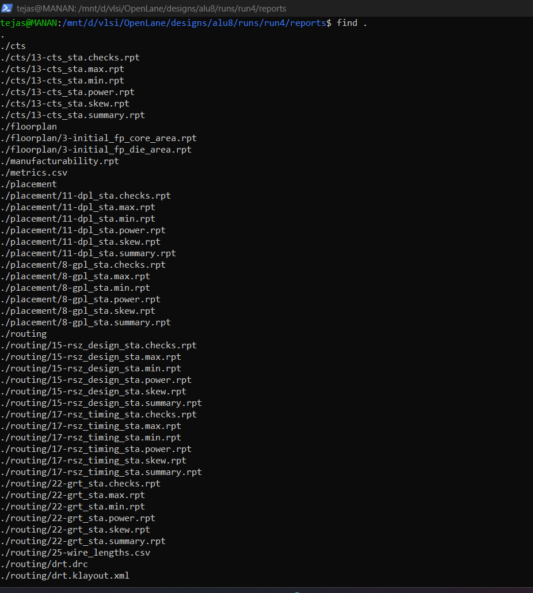
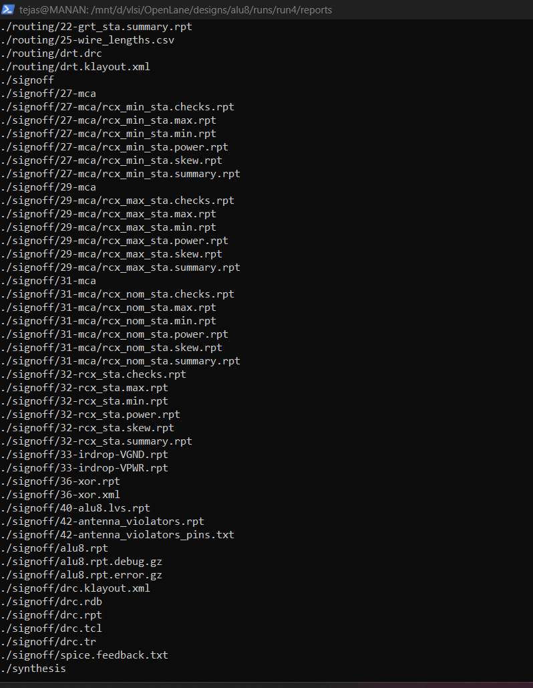
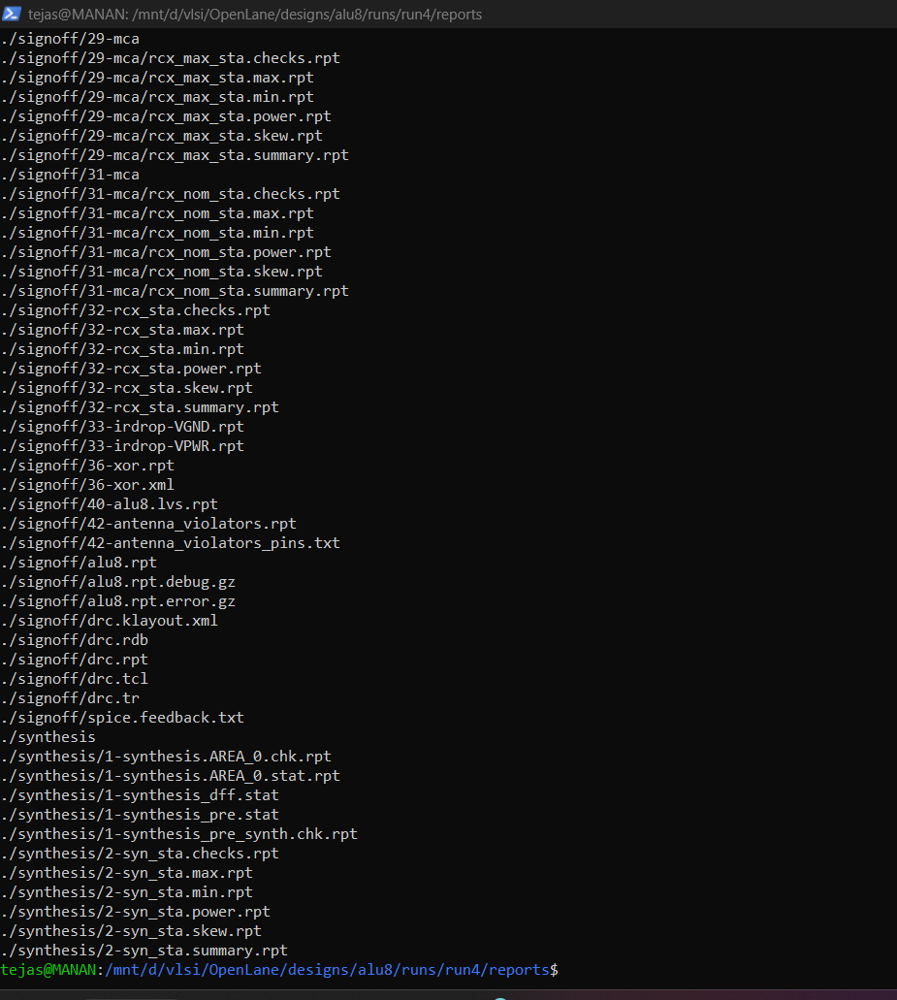

# 8-bit ALU ASIC Project (RTL-to-GDSII) using OpenLane + Sky130

## 1) Project Summary
This repository demonstrates an end-to-end ASIC implementation of an **8-bit ALU** in Verilog using the **OpenLane** digital flow on the **Sky130 PDK**.

Flow coverage:
- RTL design
- Functional verification (self-checking testbench)
- Synthesis, Floorplan, Placement, CTS, Routing
- Basic signoff checks (DRC/LVS/STA)
- Final GDSII generation and layout visualization

---

## 2) Design Specification

### Top Module
- `alu8` (legacy flow design)
- `alu` (parameterized variant, if present in `src/alu.v`)

### Inputs
- `a[7:0]`
- `b[7:0]`
- `op[2:0]`

### Outputs
- `y[7:0]`
- `carry`
- `zero`

### ALU Operations
- `000` → ADD
- `001` → SUB
- `010` → AND
- `011` → OR
- `100` → XOR
- `101` → SHL
- `110` → SHR

Flags:
- `carry`
- `zero`

---

## 3) Technology & Tools

- **PDK:** Sky130 (`sky130_fd_sc_hd`)
- **Flow:** OpenLane / OpenROAD
- **Synthesis:** Yosys
- **STA:** OpenSTA
- **DRC:** Magic / KLayout checks in flow
- **LVS:** Netgen
- **Waveforms:** GTKWave
- **Simulation/Lint (local):** Icarus Verilog, Verilator

---

## 4) Repository Structure

- `src/` → RTL sources (`alu8.v`, optional `alu.v`)
- `tb/` → testbench (`alu_tb.v`)
- `openlane/` → OpenLane config (`config.json`)
- `reports/` → selected run outputs (`.gds`, `.def`, `.gl.v`, metrics)
- `scripts/` → helper scripts (`run_sim.sh`, `run_openlane.sh`)
- `docs/` → screenshots and audit notes
- `.github/workflows/` → CI workflow(s)

---

## 5) Reproducible Run

### A) OpenLane RTL-to-GDSII (existing run style)
```bash
cd /mnt/d/vlsi/OpenLane
make mount
flow.tcl -design alu8 -tag run4 -overwrite
```

### B) Local functional simulation
```bash
cd /mnt/d/vlsi/alu8-openlane
chmod +x scripts/run_sim.sh
./scripts/run_sim.sh
```

Expected:
- Console should print pass status (if TB passes)
- `alu_tb.vcd` generated for GTKWave

### C) Lint
```bash
verilator --lint-only src/alu.v
# or:
verilator --lint-only src/alu8.v
```

---

## 6) Key Implementation Results (run4)

From `reports/metrics_run4.csv`:
- Flow status: `flow completed`
- Runtime: `0h4m7s`
- Routed runtime: `0h2m56s`
- Synth cell count: `138`
- Total cells: `1025`
- Core area: `66333.6192 um^2`
- WNS: `0.0`
- TNS: `0.0`
- Critical path: `25.01 ns`
- Suggested clock frequency: `25.0 MHz`
- Magic DRC violations: `0`
- LVS total errors: `0`
- TritonRoute violations: `0`

> Note: Metrics should be interpreted with the current constraint setup in `openlane/config.json`.

---

## 7) Output Artifacts

Primary generated files (included in repo under `reports/`):
- `reports/alu8.gds`
- `reports/alu8.def`
- `reports/alu8_gl.v`
- `reports/metrics_run4.csv`

---

## 8) Visual Evidence






---

## 9) Current Limitations (Important)

This project is a strong educational/demo ASIC implementation, but not yet full industrial tapeout signoff.  
Current gaps include:
- Constraint methodology refinement needed for production-grade timing intent
- No formal equivalence/signoff formal flow committed yet
- No DFT/scan methodology
- Limited documented coverage closure and regression statistics

---

## 10) Improvement Roadmap

Short-term:
- Add `Makefile` targets (`make sim`, `make lint`, `make reports`)
- Add auto-generated signoff summary markdown from metrics CSV
- Add gate-level simulation (GLS + optional SDF)

Mid-term:
- Add assertions / coverage tracking
- Improve timing constraint methodology and documentation
- Expand CI to publish simulation + lint artifacts

Long-term:
- Add formal checks and DFT-oriented design practices
- Add integration wrapper for realistic SoC/clock-reset context

---

## 11) Credits
Developed as an educational ASIC flow project using OpenLane + Sky130 ecosystem.
